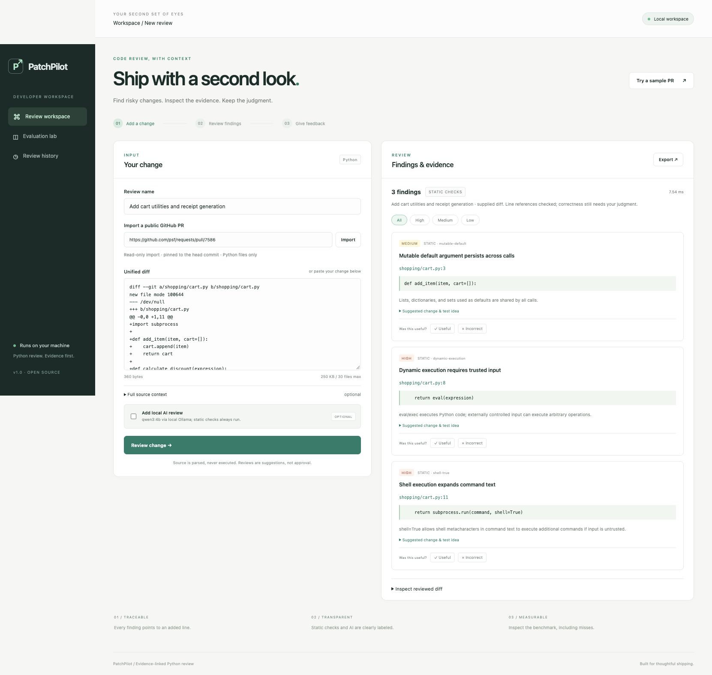

# PatchPilot

**A local Python PR reviewer that makes every finding inspectable.**

Paste a diff or import a public GitHub PR, run deterministic checks with optional local AI, inspect exact changed-line evidence, and mark findings useful or incorrect. A transparent evaluation lab shows labeled bugs, clean counterexamples and misses.



## Run in one command

Requires Python 3.12 or newer. No API key, database service, frontend build, or runtime Python packages required.

```sh
git clone https://github.com/zjh47981026/patchpilot.git
cd patchpilot
python3 -m patchpilot serve
```

Open **http://127.0.0.1:8765**. Select **Try a sample PR**, then **Review change**. The sample adds cart utilities with shared state, dynamic execution and shell execution risks. Static checks run immediately.

From a downloaded ZIP, unzip it, enter the folder containing this README, and run the same `python3 -m patchpilot serve` command.

For a different port or storage directory:

```sh
python3 -m patchpilot serve --port 8877 --data-dir ./local-data
```

## What it does

- **Changed-line review:** strict unified-diff parsing across multiple files and hunks, with separate old and new line numbers.
- **Five static rule families:** shared mutable defaults, bare exceptions, `eval`/`exec`, subprocess `shell=True`, and YAML loading without an explicit safe loader. Findings describe risks; context can make flagged patterns intentional.
- **Optional local AI:** Ollama can suggest additional bugs and tests. Schema and added-line references are checked before showing any generated finding. This validates references, not the truth of the claim.
- **Public PR import:** reads GitHub patches and complete new Python source at an exact head SHA. Rechecks the PR head and base before accepting the snapshot. No clones, credentials, private repository access, comments, or repo code execution.
- **Evidence:** clicking a finding reveals its added line in the reviewed diff. The displayed excerpt is resolved by the server, not invented by the model.
- **Local notebook:** SQLite stores review results, cited line excerpts and feedback. Full input patches/source files are not persisted. Delete a review to remove its results and feedback.
- **Export:** download a Markdown report.
- **Evaluation lab:** reproducible labeled synthetic development cases, exact path/line/rule scoring, precision, recall, F1, clean-pass rate, counts and per-case detail.

## Add local AI

Install Ollama using its [official installation instructions](https://docs.ollama.com/quickstart), then install a local coding model and start the service:

```sh
ollama pull qwen3:4b
ollama serve
```

If the Ollama app already runs the service, do not start a second server. Select **Add local AI review** in PatchPilot. To use a different installed local model:

```sh
PATCHPILOT_MODEL=qwen3:4b python3 -m patchpilot serve
```

The model endpoint is fixed to `http://127.0.0.1:11434`, proxies and redirects are disabled, and responses have byte/time limits. Configure Ollama for local-only models (`OLLAMA_NO_CLOUD=1`) if you require offline operation. Installing a model requires a download; GitHub import uses the internet. Static review and benchmark work without Ollama or network access. There is no paid API requirement.

**AI availability is not assumed.** Connection errors, timeout, malformed output or invented citations produce a visible **static fallback**. AI can hallucinate, miss bugs or follow injected source comments despite prompt precautions. Treat every finding as a suggestion. Real-model quality has not been established by the static benchmark.

## Supply enough context

A partial diff is not a complete Python module. Static AST checks run only on complete source whose displayed lines agree with the diff, or on an entirely added new file starting at line 1. Without complete source, the review warns that AST checks were skipped. Importing a public PR provides full context when available.

For pasted diffs, expand **Full source context** and provide JSON:

```json
{"cart.py": "def add_item(item, cart=[]):\n    cart.append(item)\n    return cart\n"}
```

The keys must match the diff paths; values must contain the complete new file text. Finding locations are always added lines. Unsupported file types, unavailable full context, missing GitHub textual patches, and parse limitations are explicitly reported. No findings does **not** mean a PR is safe.

## Test and evaluate

```sh
python3 -m unittest discover -s tests -v
python3 -m patchpilot evaluate
python3 -m patchpilot review changes.diff
python3 -m patchpilot review changes.diff --ai
python3 -m patchpilot evaluate --ai
```

The public development fixtures were built alongside the static rules, so they are **not held-out** and their scores do not estimate production accuracy. They include bugs, same-category clean counterexamples, prompt-injection comments, deleted-code controls and partial-context controls. Exact location/category matching counts off-target findings as errors. Unsupported-context controls are excluded from clean-pass rate. Additional AI findings require human semantic adjudication; fixture identity scoring alone cannot establish AI precision or recall.

The CI workflow runs the test suite and publishes the static development benchmark artifact on Python 3.12 and 3.13. Tests use stubbed GitHub/model responses; they never execute imported code or require a paid account.

## Design and boundaries

```text
Browser → loopback HTTP server → strict diff parser
                                 ├─ matching full source → AST static rules
                                 └─ diff data → optional local Ollama
                            → validate schema + added-line citations
                            → evidence-resolved findings → local SQLite

Public GitHub PR → head/base snapshot → pinned source → consistency recheck
```

See [architecture](docs/architecture.md) and [security model](SECURITY.md). This is a single-user local portfolio application, not an internet-facing multi-tenant service. Do not deploy the built-in HTTP server publicly. Bind address is fixed to loopback; Host/Origin and per-process request tokens protect the browser boundary. Results are plain text in the UI; no generated HTML or Markdown is rendered.

## Repository

```text
patchpilot/
  diff.py          Strict parser and line mapping
  reviewer.py      Static AST checks and review orchestration
  model.py         Local AI adapter and response validation
  github.py        Read-only public PR snapshots
  evaluation.py    Transparent synthetic benchmark
  store.py         Local results and feedback
  server.py        Loopback HTTP API
  static/          Responsive interface (no build step)
  fixtures/        Versioned synthetic development dataset
tests/             Parser, review, model, importer, storage and HTTP tests
```

## Tradeoffs

Static checks focus on five explainable pattern families. They do not prove exploitability, detect arbitrary business-logic bugs, perform cross-file type inference or resolve all symbol shadowing. AI sees diff context, not an entire repository. Large changes exceed bounded budgets instead of being silently truncated. GitHub renamed/non-UTF-8/binary files may be unsupported; import reports coverage warnings. API rate limits can require waiting or pasting a diff instead.

Feedback records human judgments for inspection; it does not retrain a model or change scoring labels. Future work: a frozen held-out dataset with human-adjudicated AI findings, richer import coverage and optional authenticated review integration.

MIT licensed.
